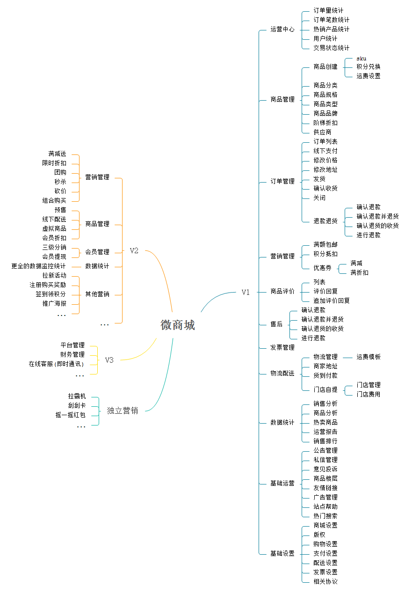

## RF 微商城

### 前言

基于 [RageFrame2](https://github.com/jianyan74/rageframe2) 的一款免费开源的基础商城销售功能的开源微商城，前端基于 uni-app，一端发布多端通用，目前已经适配 H5、微信小程序、QQ小程序、Ios App、Android App。目前开源的版本功能为 V1 版，更多增强功能(V2、V3)敬请期待。

### 项目地址

[前端开源地址](https://github.com/stavyan/TinyShop-UniApp): https://github.com/stavyan/TinyShop-UniApp

[Uni-App插件地址](https://ext.dcloud.net.cn/plugin?id=1427): https://ext.dcloud.net.cn/plugin?id=1427

[后端开源地址](https://github.com/jianyan74/TinyShop): https://github.com/jianyan74/TinyShop

### 更新记录

#### 2020-03-24

> [更多更新记录](docs/UPDATE.md)

### Demo

[H5 预览](http://h5.tinyshop.rageframe.com): http://h5.tinyshop.rageframe.com  

Android App体验版 [下载](http://h5.tinyshop.rageframe.com/RageFrameTinyShop.apk) 

微信小程序和QQ小程序正处于审核阶段, 可自行clone至本地运行。

[uni-app发布页](https://m3w.cn/rageframewsc): https://m3w.cn/rageframewsc

[后台预览](http://demo2.rageframe.com/backend): http://demo2.rageframe.com/backend

账号: demo   
密码: 123456 

 

### 思维导图



### 安装说明

1、安装相关依赖, 默认已拥有node环境

```
// 安装yarn命令
npm i -g yarn
// 安装依赖
yarn 
```

2. 运行到指定平台

```
// 运行到H5
yarn serve
// 运行至对应的小程序平台 
yarn dev:PLATFORM
```

值 | 平台
---|---
h5 | H5
mp-weixin | 微信小程序
mp-alipay | 支付宝小程序
mp-baidu | 百度小程序
mp-toutiao | 头条小程序
mp-qq | qq 小程序


3. 打包至线上部署
```
// H5打包
yarn build
yarn build:PLATFORM // 平台信息同上
```
使用对应的小程序客户端进行发布。

4、发布uni-app(打包为原生App云端)

配合HBuilderX使用

### 配置文件

> [详见配置说明](docs/CONFIG.md)

### 项目结构

> [详见项目结构](docs/CONSTRUCTION.md)

### 官网

http://www.rageframe.com

### 问题反馈

在使用中有任何问题，欢迎反馈给我，可以用以下联系方式跟我们交流

QQ群：[655084090](https://jq.qq.com/?_wv=1027&k=4BeVA2r)

### 特别鸣谢

感谢以下的项目，排名不分先后

Vuejs： https://github.com/vuejs/vue

uni-app： https://uniapp.dcloud.io/

mix-mall: https://ext.dcloud.net.cn/plugin?id=200

ColorUI: https://github.com/weilanwl/ColorUI
...

### 版权信息

RageFrame 遵循 Apache2 开源协议发布，并提供免费使用。

本项目包含的第三方源码和二进制文件之版权信息另行标注。

版权所有Copyright © 2016-2020 by RageFrame [www.rageframe.com](http://www.rageframe.com)

All rights reserved。
